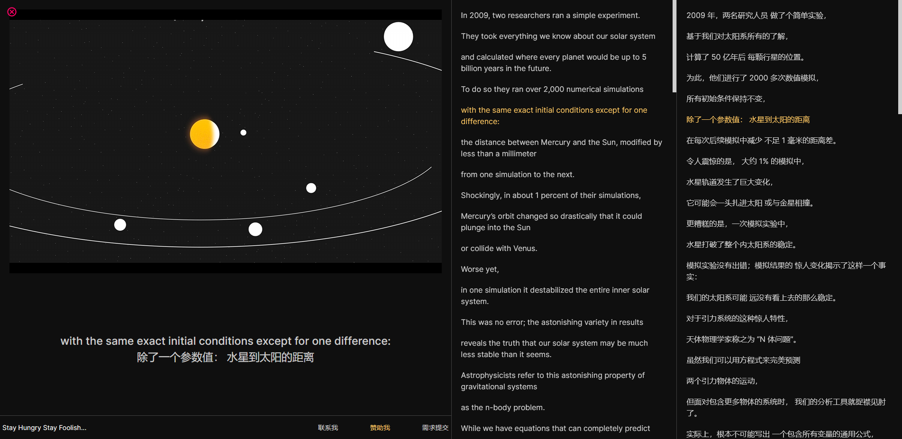

# Stylish Reader

Firefox extension that helps you learn English better and easier.

## Feature List
- [x] Translate the selected word/phrase/sentence from English to Chinese.
- [x] Collect/Favorite new word.
- [x] Recite the collected word.
- [x] See the real-time bilingual live subtitles while watching TED videos.

## TODO List
- [ ] Official website established.
- [ ] Refactor English-Burning APP for better user experience.
- [ ] BBC Learning English(6 minutes English) supported.
- [ ] Collect/Favorite articles, provide reading mode afterwards.

## TED Website ScreenShot

