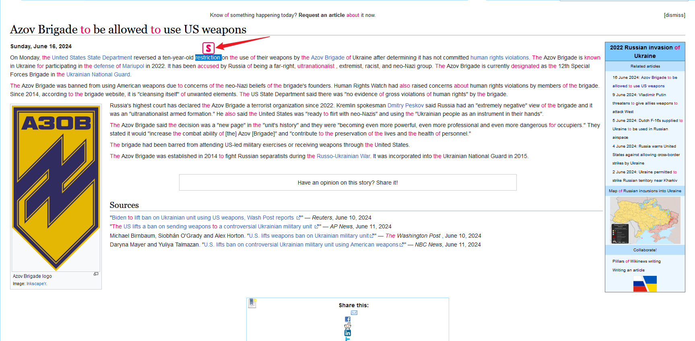
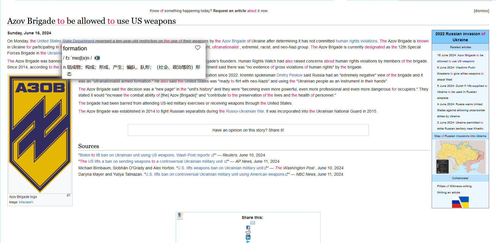
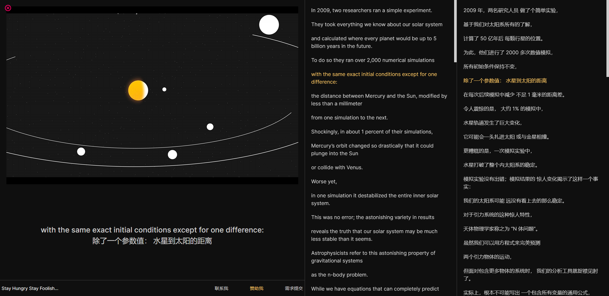

# Stylish Reader

Firefox extension that helps you learn English better and easier.

## Feature List

- [x] Translate the selected word/phrase/sentence from English to Chinese.
- [x] Collect/Favorite new word.
- [x] Recite the collected word.
- [x] See the real-time bilingual live subtitles while watching TED videos.

## TODO List

- [ ] Official website established.
- [ ] Refactor English-Burning APP for better user experience.
- [ ] BBC Learning English(6 minutes English) supported.
- [ ] Collect/Favorite articles, provide reading mode afterwards.

## Highlight and search words

- All collected words will be hightlighted on the webpage.

- You can search unknown words by selecting text.

- Realtime translation panel

## Realtime bilingual live subtitles

### TED official website

You can see the real-time bilingual live subtitles while watching TED videos.

