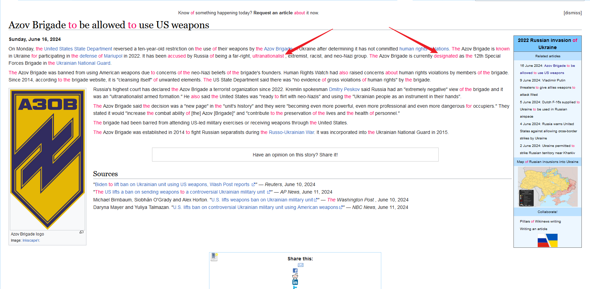

# Stylish Reader

Firefox extension that helps you learn English better and easier.

## Feature List

- [x] Translate the selected word/phrase/sentence from English to Chinese.
- [x] Collect/Favorite new word.
- [x] Recite the collected word.
- [x] See the real-time bilingual live subtitles while watching Youtube videos.
- [x] Save `The Guardian` article automatically for later test.

For more features, you could have a look at the [official website.](https://stylishreader.com/#/)

## Highlight and search words

- All collected words will be hightlighted on the webpage.

- You can search unknown words by selecting text.

- Realtime translation panel

## Realtime bilingual live subtitles

### TED official website

You can see the real-time bilingual live subtitles while watching TED videos.

### Youtube video review

You can save the YouTube video to your account and see the real-time bilingual live subtitles later.
